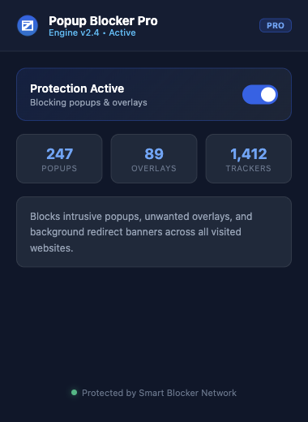
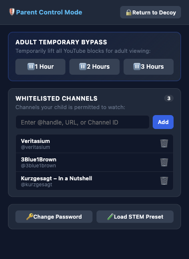
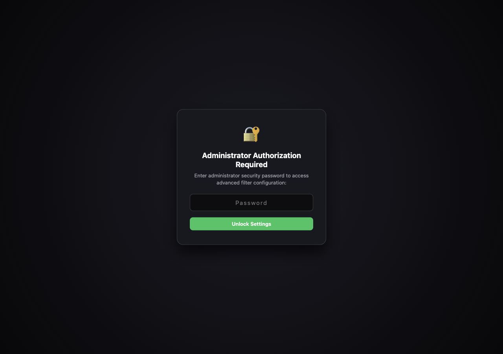
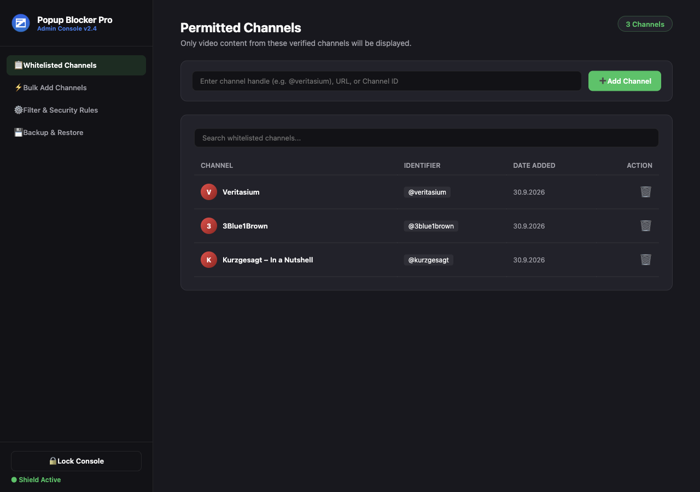

# YouTube Channel Allowlist

A Manifest V3 extension for Brave and Chromium-based browsers that lets a parent maintain a YouTube channel allowlist and apply browser-side filtering to YouTube pages.

> **Scope:** This is a browser extension, not a tamper-proof parental-control boundary. Use supervised accounts and browser/device controls as well if a child can manage the browser or its extensions.

## Screenshots

### Toolbar popup

*The toolbar popup's dashboard. Its toggle is a decoy and does not switch the YouTube filtering on or off.*

### Parent controls

*The parent panel for managing the channel allowlist and temporary bypass. The channel entries shown are illustrative.*

### Options access

*The options page is protected by the administrator password.*

### Channel settings

*The options page includes channel management, bulk import, filtering controls, and backup tools. The channel entries shown are illustrative.*

## Features

- Manage approved YouTube channels by handle, channel URL, or channel ID.
- Add or remove channels in the popup or options page, and import multiple entries at once.
- Filter YouTube video feeds against the saved allowlist.
- Show a restricted-content overlay when opening a video from a channel that is not approved.
- Browse approved channels from the **My Channels** page in YouTube.
- Use the popup's temporary bypass controls when an adult needs unrestricted viewing.

## Install in Brave or Chromium

This project is loaded as an unpacked extension; there is no build step.

1. Clone or download this repository.
2. Open `brave://extensions` (or `chrome://extensions` in Chrome).
3. Turn on **Developer mode**.
4. Choose **Load unpacked** and select the repository folder containing `manifest.json`.
5. Pin **Smart Popup Blocker Pro** to the toolbar for convenient access.

After changing the extension's source files, return to the extensions page and click **Reload** on its card.

## Open the parent controls

1. Click the **Smart Popup Blocker Pro** toolbar icon.
2. In the description, click the letter **k** in **“Blocks”** to reveal the administrator password prompt.
3. Enter the administrator password and choose **Unlock**.

The default password is **`varna`**. Change it after installation using **Change Password** in the popup or **Filter & Security Rules** in the options page.

You can also open the options page from the extension's context menu in `brave://extensions` or `chrome://extensions`, then unlock it with the same password.

## Manage channels and settings

- Add a channel in the popup using its handle, channel URL, or channel ID. On a YouTube video or channel page, the popup can offer a detected-channel quick-add button.
- Use the options page to search and manage the channel list, bulk-import one channel per line, and access the rule and backup sections.
- The popup includes a curated STEM channel preset.
- The popup also provides 1-, 2-, and 3-hour bypass choices and a control to end a bypass early.
- The decoy popup-blocker toggle only changes its displayed status. It does **not** enable or disable the YouTube filtering.

## Permissions and data

- **Storage:** saves the channel list and extension settings in the browser profile using `chrome.storage.local`.
- **Tabs:** lets the popup inspect the active tab and detect a YouTube channel for quick-add.
- **YouTube access:** the content script applies the page-level filtering on YouTube domains. The extension may request a YouTube channel page to look up missing avatar information.

The administrator password is stored in extension storage and acts as a convenience lock, not strong authentication. Anyone who can control the browser profile or manage its extensions may be able to inspect, disable, or remove the extension. Change the default password and use appropriate browser/device supervision for stronger parental controls.

## License

This project is distributed under the [Apache License 2.0](LICENSE).
